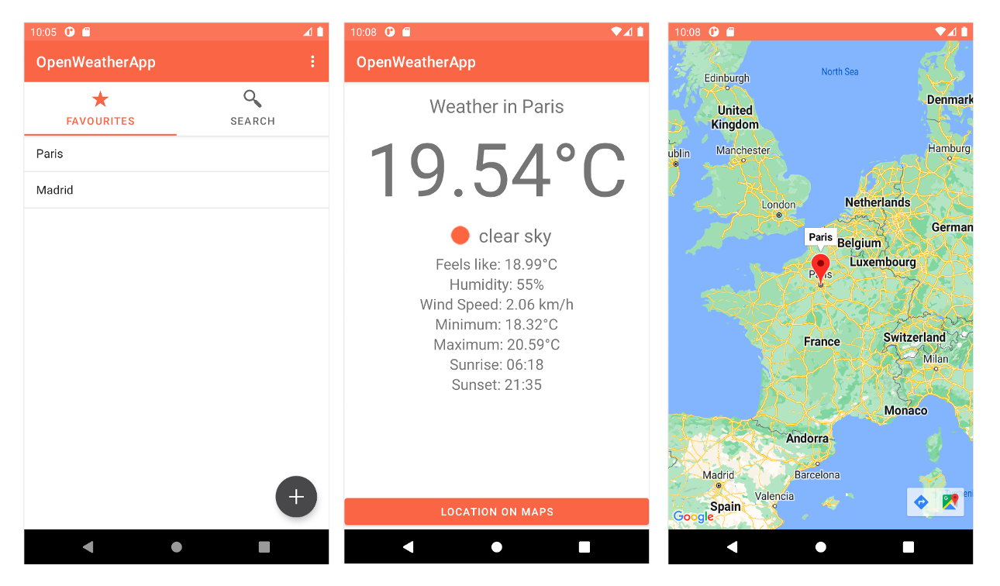

# OpenWeatherApp

This application is an weather checker based on the data provided by OpenWeatherAPI.

The free use of this API provides a JSON file with the current weather conditions from everywhere in the world, so the developed application will be able to process this data and provide it in an user friendly way.

The link to this API is the following one: https://openweathermap.org/api

+ [Design Pattern](doc/design_pattern.md)
+ [Application UI](doc/application_ui.md)
   +  [SplashScreen](doc/splash_screen.md)
   +  [MainActivity](doc/main_activity.md)
      +  [FavsFragment](doc/favs_fragment.md)
      +  [SearchFragment](doc/search_fragment.md)
   + [WeatherDisplayActivity](doc/weather_display_activity.md)
   + [MapsActivity](doc/maps_activity.md)
   + [AboutActivity](doc/about_activity.md)
+ [Future Work](doc/future_work.md)

# Author

This application was developed by [Alejandro Buján Pampín](mailto:alejandro.bujan.pampin@gmail.com).
