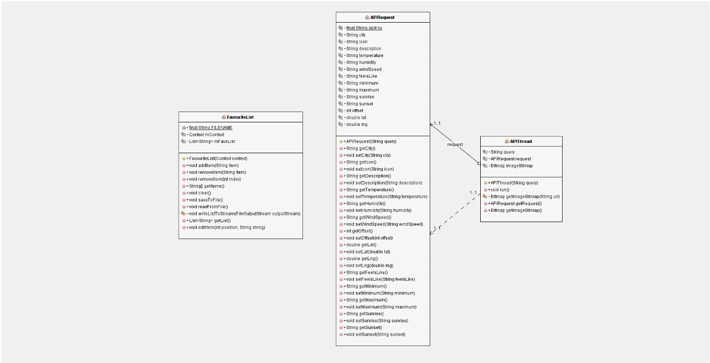

# Design Pattern

MVC pattern was applied in this solution.

## Model

## View

XML files containing the screen layouts, elements and all other static data belonging to the UI.

## Controller

JAVA files containing the interaction with the elements and how the views are updated.

[Link to Application UI](application_ui.md)