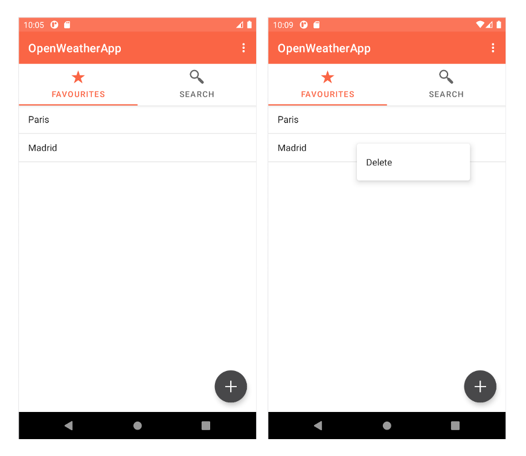

# MainActivity. FavsFragment

The first fragment of the MainActivity consists in a ListView with favourite places to check the weather without having to search it. 

As you can see the user is able to add more places as well as deleting them.

This data is stored persistently.

