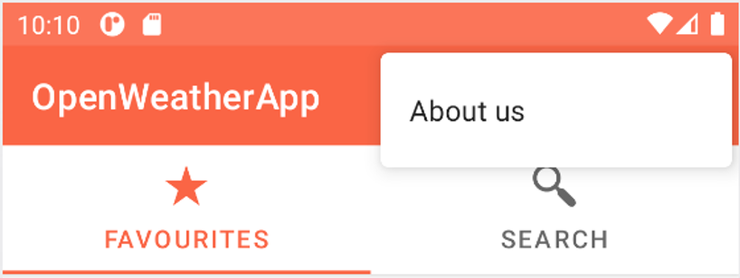

# MainActivity

As you can see, the application’s MainActivity is a tabbed activity, the user can shift between tabs sliding or pressing in the corresponding tab. 

Moreover, there is a app bar menu that allows the user to access generic options, where right now an About Us screen access entry is implemented, but makes sense to consider to place a preferences screen or an online support option in this menu as future work.

Fragments inside MainActivity:
+ [FavsFragment](favs_fragment.md)
+ [SearchFragment](search_fragment.md)