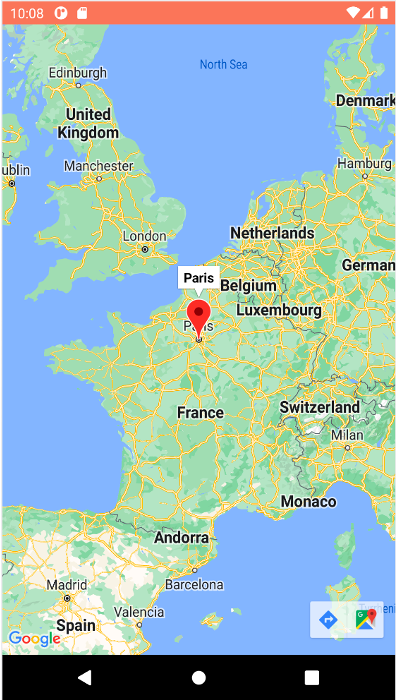

# MapsActivity

The user is able to check the location of the target place via Google Maps.

This feature is interesting as it is possible to trace routes to the place and being redirected to the Google Maps app.

