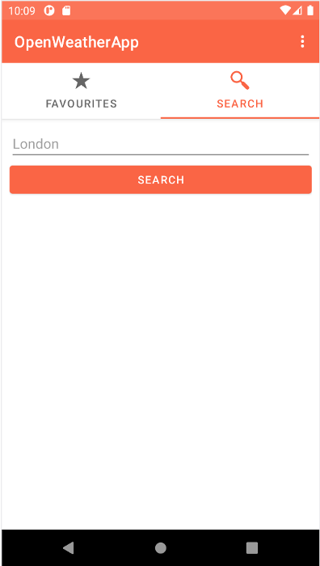

# MainActivity. SearchFragment

The second fragment of the MainActivity consists in a search form which performs a Http request to the API based on the place given.

If there aren’t avaliable results for the requested place, the user will be informed.

The UI won’t allow the user to perform a empty request. 

